## Nacos 服务注册源码分析
本次分析的Nacos客户端和服务端版本都是1.4.2。

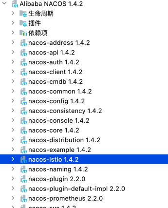


### 客户端核心源码
#### 源码分析过程
1. 首先查看spring-cloud-starter-alibaba-nacos-discovery依赖的自动装配文件spring.factories
```aidl
<dependency>
    <groupId>com.alibaba.cloud</groupId>
    <artifactId>spring-cloud-starter-alibaba-nacos-discovery</artifactId>
</dependency>
```


2. 找到Nacos服务注册自动配置类
   

3. 查看NacosServiceRegistryAutoConfiguration类源码,在该类中注入了一个Bean：
   NacosAutoServiceRegistration
   
4. 该类继承了AbstractAutoServiceRegistration，实现了ApplicationListener的onApplicationEvent方法，在该方法中调用了bind方法。
   
5. 一直追踪下去可以进入到com.alibaba.cloud.nacos.registry.NacosServiceRegistry.register
   
6. 在com.alibaba.nacos.client.naming.NacosNamingService.registerInstance方法中，判断是否是临时实例，如果是的话，每隔5秒定时发送心跳信息。
   
7. 在方法com.alibaba.nacos.client.naming.net.NamingProxy.registerService中执行具体注册的逻辑：发起POST请求将客户端数据发送给nacos服务端。
   
### 客户端注册流程图


### 服务端核心源码
#### 源码分析过程
1. 因为客户端将数据发送给接口/nacos/v1/ns/instance，故，这里我们查看该接口,该接口在nacos-naming模块的InstanceController中。
   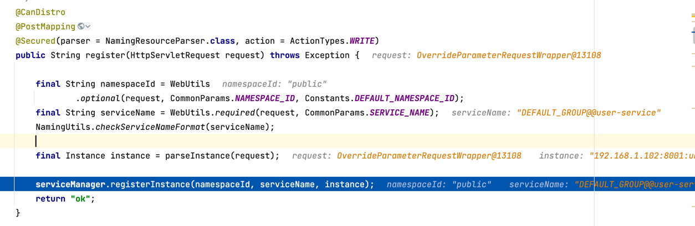
2. ServiceManager类中一个属性serviceMap，Map(namespace, Map(group::serviceName, Service))
   如果是第一次的话，新建一个空的服务放入注册表内并初始化。具体代码见putServiceAndInit方法。


putService方法：将服务存入Map中。

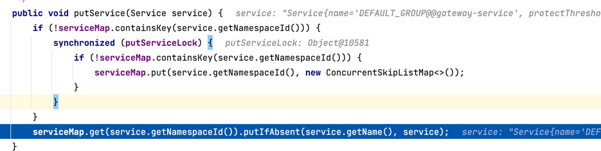

3. 初始化操作逻辑在service.init()方法中，首先会开启一个定时任务，每隔5秒中去检查客户端的最近的心跳时间是否超过默认的超时时间15秒，如果超过了，
   设置健康状态为false；如果超过了30秒就会将该实例删除。
   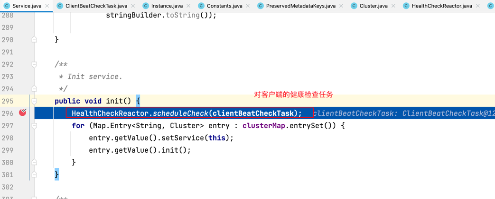
4. 将服务的实例信息保存起来，并且同步给Nacos集群的其他节点。addIPAddress中，会拷贝旧的实例列表，添加新实例到列表中。
   完成对实例状态更新后，则会用新列表直接覆盖旧实例列表。而在更新过程中，旧实例列表不受影响，用户依然可以读取。
   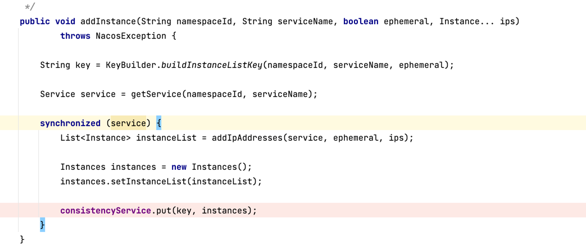

5. 集群数据同步代码：


onPut()方法：


6. notifier 是一个 com.alibaba.nacos.naming.consistency.ephemeral.distro.DistroConsistencyServiceImpl 内部类。
   并且在DistroConsistencyServiceImpl初始化时就通过一个单线程开始一个定时任务，不断从阻塞队列中获取任务，执行服务列表的更新
   

7. 在定时任务中处理代码：


8. handle()方法如下，当服务变更了出发service类中的onChange方法。


9. 在distroProtocol.sync 同步集群中节点的数据。


同步失败的话，会重试处理。属于AP模式。


10. 通过Http的形式给集群中其他节点同步数据。


### 总结
1、使用了很多的异步任务和队列。
Nacos内部会将服务注册的任务放入阻塞队列，采用线程池异步来完成实例更新，从而提高并发写能力。

2. 免并发读写的冲突
   Nacos在更新实例列表时，会采用CopyOnWrite技术，首先将Old实例列表拷贝一份，然后更新拷贝的实例列表，再用更新后的实例列表来覆盖旧的实例列表。

## Nacos服务发现源码分析
### 客户端源码分析流程
1. Nacos 服务发现的入口类是 NacosDiscoveryClient，该类实现了Spring Cloud DiscoveryClient接口。
   该类主要由两个方法，getServices和 getInstances，前者用来获取全部的服务名称，后者根据服务id获取指定的实例信息。
2. getServices的逻辑比较简单，就是调用服务端接口，把所有注册的服务的名称获取回来，我们先看getInstances方法。

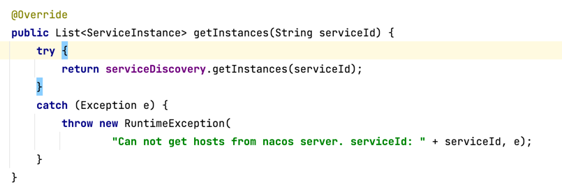

3. 获取指定的服务的实例信息时，首先判断是否订阅， 如果订阅了，会先从本地缓存中找，
   如果没有再到nacos服务端中去查询并更新到本地缓存中去。

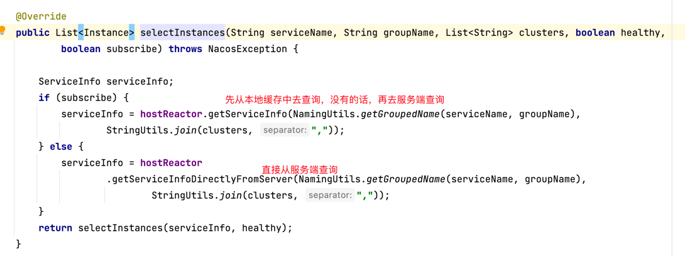

4. 到服务端主动查询实例的代码如下：

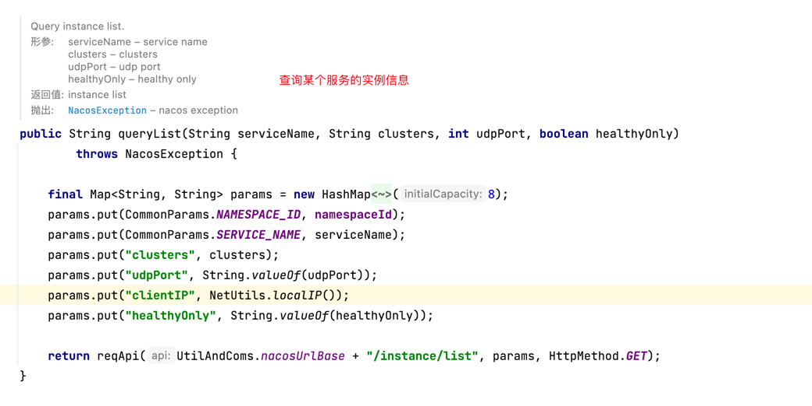

6. 本地缓存是如何和服务端保持同步更新的？
7. 首先客户端通过PushReceiver开启一个udp连接到服务端，实时获取由服务端推送的数据，并将数据更新到本地缓存。
   然后发送ack信息到服务端，以便让服务端判断是否重试。

   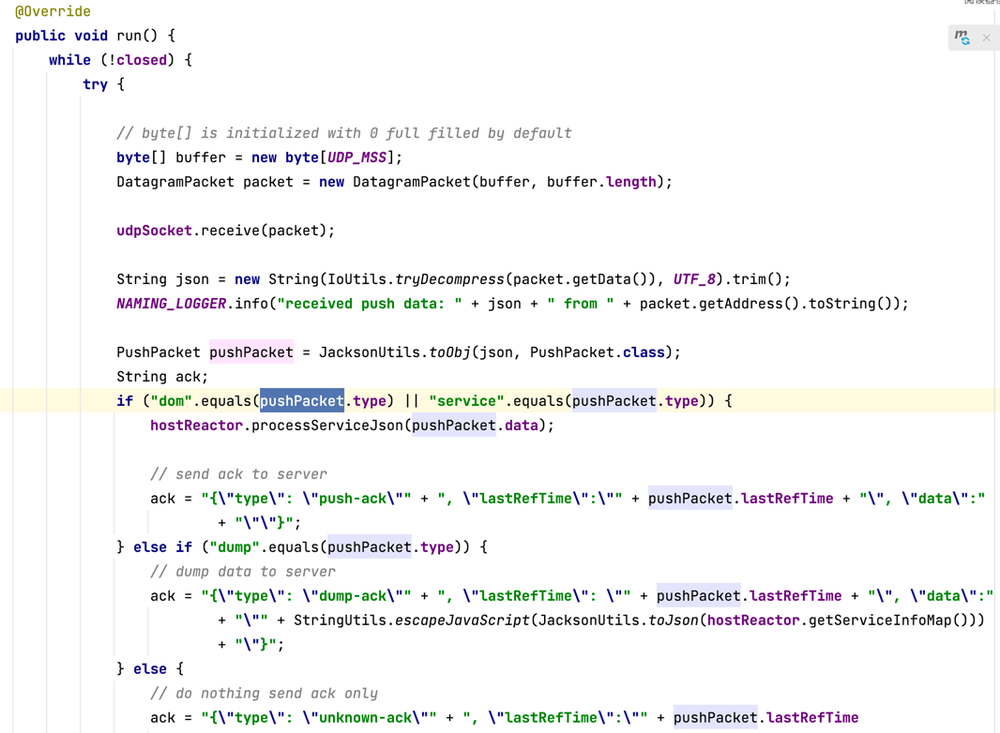
8.


还有一个定时任务，每隔1秒去从服务端获取最新的服务信息并更新缓存。


### 服务端源码
1. 从客户端源码可以看出，客户端的服务发现由两种模式，主动拉取和被动接收。
2. 主动拉取要调用的接口是：/ns/v1/instance/list/,主要逻辑就是添加一个pushclient，然后获取实例信息并返回。
   com.alibaba.nacos.naming.controllers.InstanceController#list

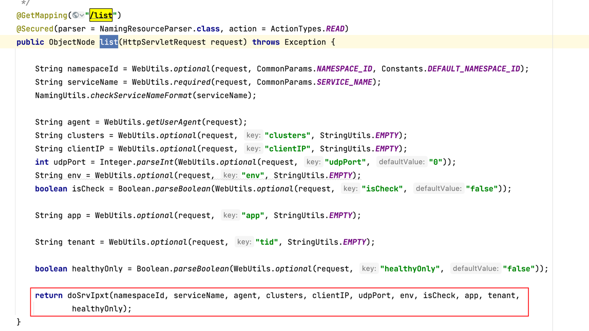
尝试添加一个pushClient。
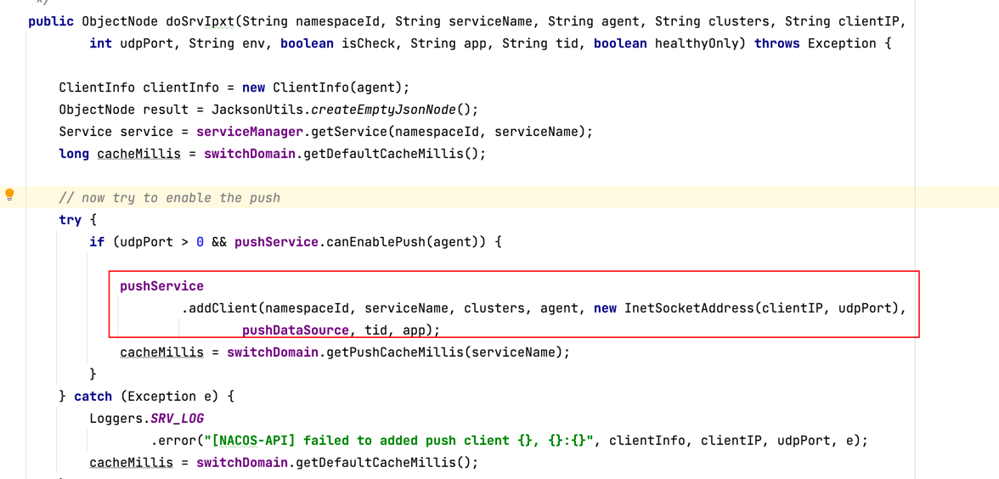

3. 主动推送的代码：com.alibaba.nacos.naming.push.PushService 中，在静态代码块中做了如下的事：

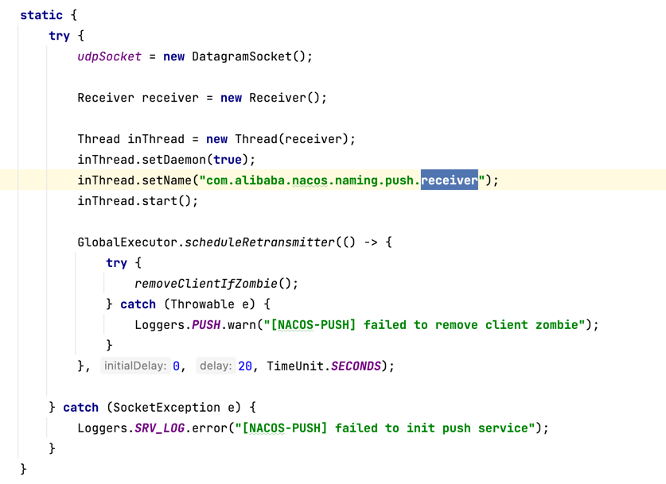

4. 该类实现了ApplicationListener，在实现的方法onApplicationEvent中

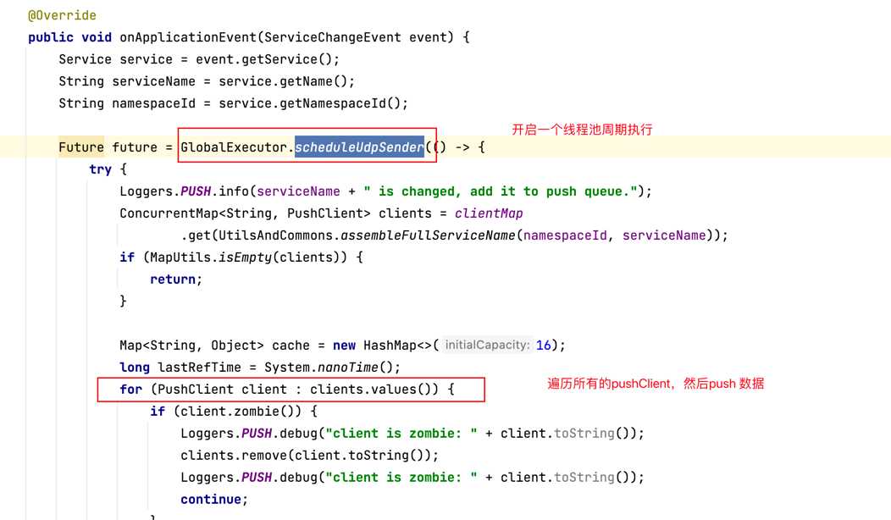

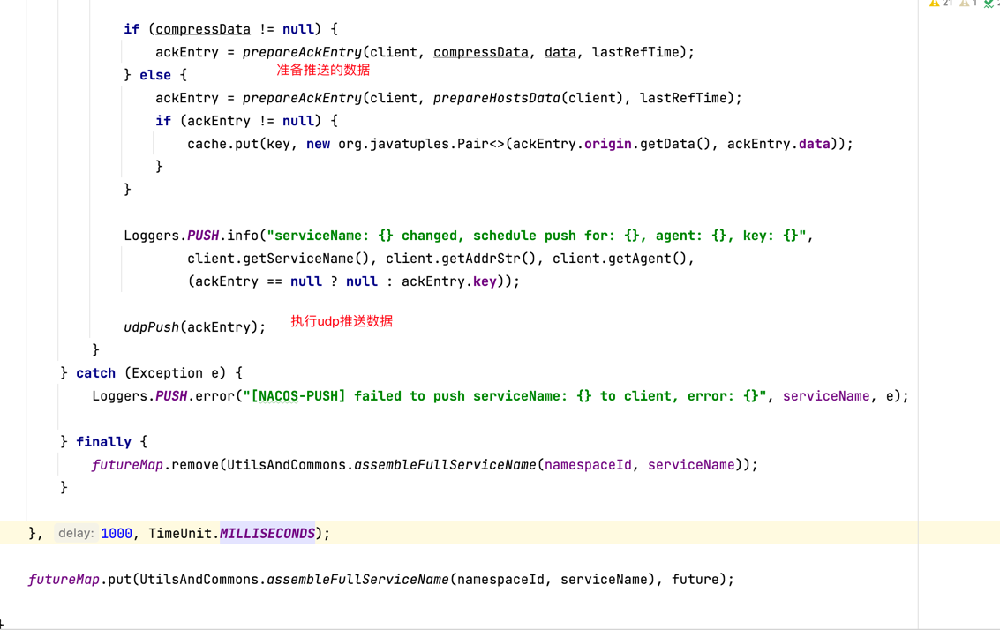

5. udpPush()方法：

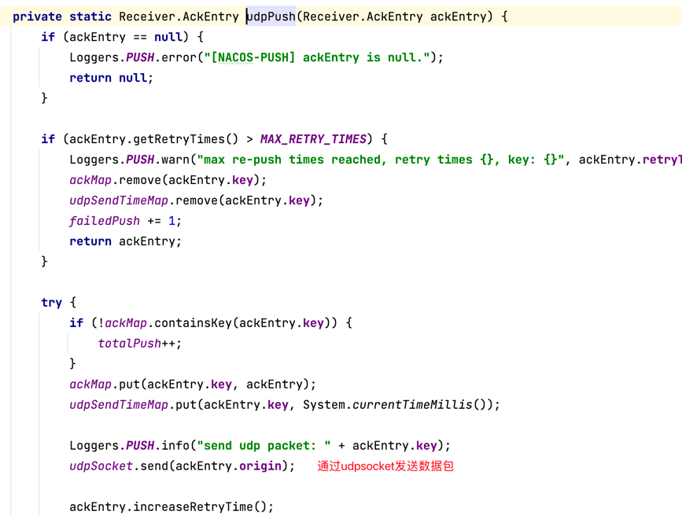