# Nacos 服务注册源码分析

## 版本介绍
- Nacos客户端和服务端版本都是1.4.2。
- spring-cloud-alibaba-starters版本2.2.6.RELEASE。

## 客户端核心源码
### 源码分析过程
#### 找到自动配置类
1. 首先查看spring-cloud-starter-alibaba-nacos-discovery依赖的自动装配文件spring.factories
```xml
<dependency>
    <groupId>com.alibaba.cloud</groupId>
    <artifactId>spring-cloud-starter-alibaba-nacos-discovery</artifactId>
</dependency>
```


2. 找到Nacos服务注册自动配置类和入口
   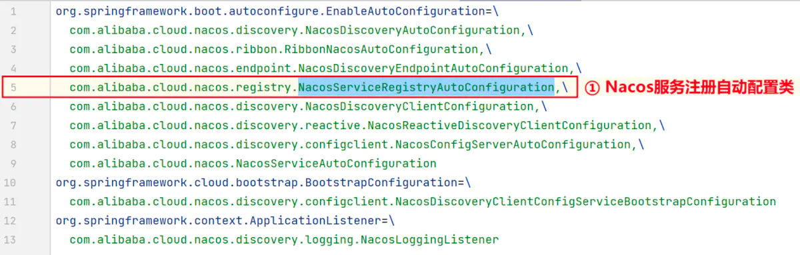

3. 查看NacosServiceRegistryAutoConfiguration类源码,在该类中注入了一个Bean：
   NacosAutoServiceRegistration
   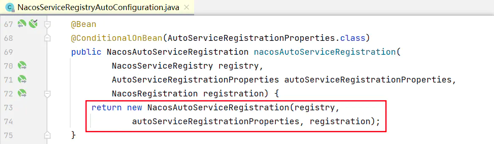
4. 该类继承了AbstractAutoServiceRegistration，实现了ApplicationListener的onApplicationEvent方法，在该方法中调用了bind方法。
#### 注册的逻辑：
   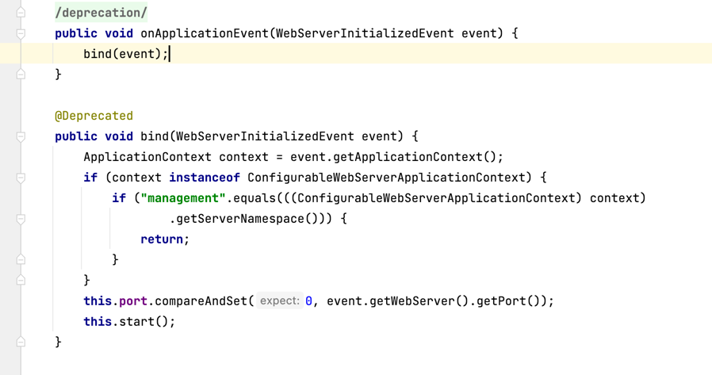
5. 一直追踪下去可以进入到com.alibaba.cloud.nacos.registry.NacosServiceRegistry.register
   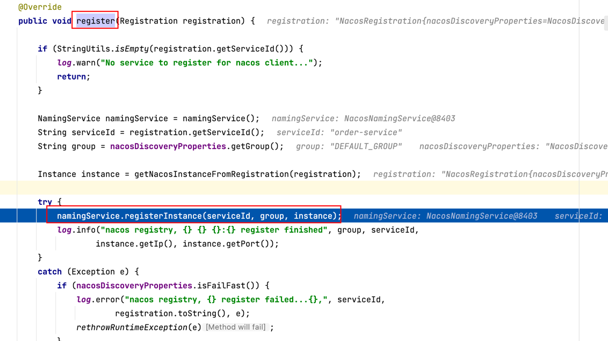
6. 在com.alibaba.nacos.client.naming.NacosNamingService.registerInstance方法中，判断是否是临时实例，如果是的话，每隔5秒定时发送心跳信息。
   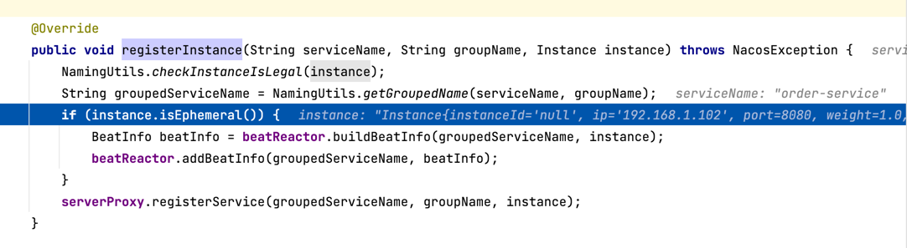
7. 在方法com.alibaba.nacos.client.naming.net.NamingProxy.registerService中执行具体注册的逻辑：发起POST请求将客户端数据发送给nacos服务端。
   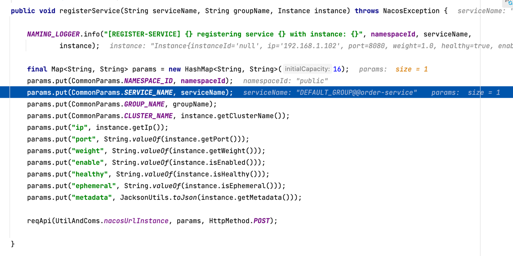
### 客户端注册流程图

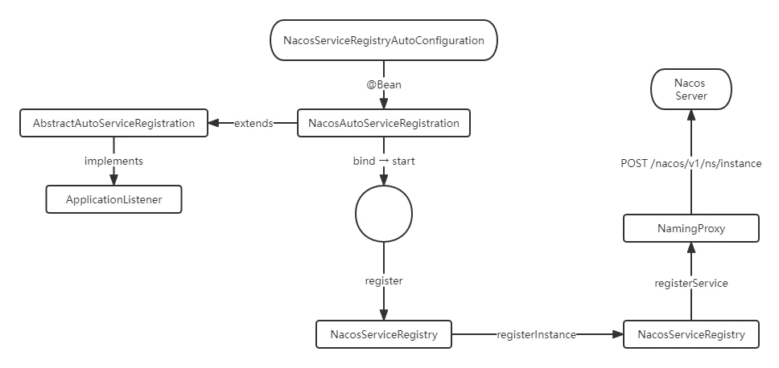

## 服务端核心源码
### 源码分析过程
1. 因为客户端将数据发送给接口/nacos/v1/ns/instance，故，这里我们查看该接口,该接口在nacos-naming模块的InstanceController中。
```java 
    @CanDistro
    @PostMapping
    @Secured(parser = NamingResourceParser.class, action = ActionTypes.WRITE)
    public String register(HttpServletRequest request) throws Exception {
        
        final String namespaceId = WebUtils
                .optional(request, CommonParams.NAMESPACE_ID, Constants.DEFAULT_NAMESPACE_ID);
        final String serviceName = WebUtils.required(request, CommonParams.SERVICE_NAME);
        NamingUtils.checkServiceNameFormat(serviceName);
        
        final Instance instance = parseInstance(request);
        // 调用的是ServiceManager的registerInstance方法
        serviceManager.registerInstance(namespaceId, serviceName, instance);
        return "ok";
    }
    
    // ServiceManager的注册方法。
     public void registerInstance(String namespaceId, String serviceName, Instance instance) throws NacosException {
     // 创建一个空的服务
     createEmptyService(namespaceId, serviceName, instance.isEphemeral());
     Service service = getService(namespaceId, serviceName);
     if (service == null) {
         throw new NacosException(NacosException.INVALID_PARAM,
                 "service not found, namespace: " + namespaceId + ", service: " + serviceName);
     }
     // 添加实例
     addInstance(namespaceId, serviceName, instance.isEphemeral(), instance);
 }
```
- 先看下如何创建空服务的
```java 
// 创建一个空的服务
    public void createEmptyService(String namespaceId, String serviceName, boolean local) throws NacosException {
      createServiceIfAbsent(namespaceId, serviceName, local, null);
   }
   
   // 实际上当服务不存在才会创建
   public void createServiceIfAbsent(String namespaceId, String serviceName, boolean local, Cluster cluster)
         throws NacosException {
    // 根据服务名称和namespaceId获取服务
     Service service = getService(namespaceId, serviceName);
     if (service == null) {
         
         Loggers.SRV_LOG.info("creating empty service {}:{}", namespaceId, serviceName);
         service = new Service();
         service.setName(serviceName);
         service.setNamespaceId(namespaceId);
         service.setGroupName(NamingUtils.getGroupName(serviceName));
         // now validate the service. if failed, exception will be thrown
         service.setLastModifiedMillis(System.currentTimeMillis());
         service.recalculateChecksum();
         // 服务下面是有集群的
         if (cluster != null) {
             cluster.setService(service);
             service.getClusterMap().put(cluster.getName(), cluster);
         }
         // 校验名称是否符合规则
         service.validate();
         // 添加服务并且初始化
         putServiceAndInit(service);
         if (!local) {
             addOrReplaceService(service);
         }
     }
 }
    // 添加服务并且初始化
     private void putServiceAndInit(Service service) throws NacosException {
       // 添加服务，这里用到了双重检索，防止重复添加
       // 放到了一个Map中，结构是Map(namespace, Map(group::serviceName, Service))
        putService(service);
        service = getService(service.getNamespaceId(), service.getName());
        // 服务初始
        service.init();
        
        // 这里就是需要将注册的服务信息同步给其他节点。
        // 临时节点和持久节点都监听了一遍，后面详细介绍具体逻辑
        consistencyService
                .listen(KeyBuilder.buildInstanceListKey(service.getNamespaceId(), service.getName(), true), service);
        consistencyService
                .listen(KeyBuilder.buildInstanceListKey(service.getNamespaceId(), service.getName(), false), service);
        Loggers.SRV_LOG.info("[NEW-SERVICE] {}", service.toJson());
    }
    
    // 服务初始化
     public void init() {
     // 每隔5秒执行一次心跳检测任务
     HealthCheckReactor.scheduleCheck(clientBeatCheckTask);
     for (Map.Entry<String, Cluster> entry : clusterMap.entrySet()) {
         entry.getValue().setService(this);
         entry.getValue().init();
     }
   }
   
   // 心跳检测任务
   @Override
    public void run() {
        try {
            if (!getDistroMapper().responsible(service.getName())) {
                return;
            }
            
            if (!getSwitchDomain().isHealthCheckEnabled()) {
                return;
            }
            
            List<Instance> instances = service.allIPs(true);
            
            // first set health status of instances:
            for (Instance instance : instances) {
               // 15秒未联系到客户端，标记不健康
                if (System.currentTimeMillis() - instance.getLastBeat() > instance.getInstanceHeartBeatTimeOut()) {
                    if (!instance.isMarked()) {
                        if (instance.isHealthy()) {
                            instance.setHealthy(false);
                            Loggers.EVT_LOG
                                    .info("{POS} {IP-DISABLED} valid: {}:{}@{}@{}, region: {}, msg: client timeout after {}, last beat: {}",
                                            instance.getIp(), instance.getPort(), instance.getClusterName(),
                                            service.getName(), UtilsAndCommons.LOCALHOST_SITE,
                                            instance.getInstanceHeartBeatTimeOut(), instance.getLastBeat());
                            getPushService().serviceChanged(service);
                            ApplicationUtils.publishEvent(new InstanceHeartbeatTimeoutEvent(this, instance));
                        }
                    }
                }
            }
            
            if (!getGlobalConfig().isExpireInstance()) {
                return;
            }
            
            // then remove obsolete instances:
            for (Instance instance : instances) {
                
                if (instance.isMarked()) {
                    continue;
                }
                // 30秒未联系到客户端，直接删除。
                if (System.currentTimeMillis() - instance.getLastBeat() > instance.getIpDeleteTimeout()) {
                    // delete instance
                    Loggers.SRV_LOG.info("[AUTO-DELETE-IP] service: {}, ip: {}", service.getName(),
                            JacksonUtils.toJson(instance));
                    deleteIp(instance);
                }
            }
            
        } catch (Exception e) {
            Loggers.SRV_LOG.warn("Exception while processing client beat time out.", e);
        }
    }
```
- 然后再看下添加实例这个方法
```java 
    public void addInstance(String namespaceId, String serviceName, boolean ephemeral, Instance... ips)
        throws NacosException {

        String key = KeyBuilder.buildInstanceListKey(namespaceId, serviceName, ephemeral);
         // 先获取这个服务
        Service service = getService(namespaceId, serviceName);
    synchronized (service) {
         // 拷贝旧的实例列表，添加新实例到列表中。、
        List<Instance> instanceList = addIpAddresses(service, ephemeral, ips);

        Instances instances = new Instances();
        instances.setInstanceList(instanceList);
         // 完成对实例状态更新后，则会用新列表直接覆盖旧实例列表
        consistencyService.put(key, instances);
        }
    }
```


#### 集群数据同步
根据注册的字段ephemeral判断是否是临时客户端还是持久节客户端，不同的节点采用不同的数据同步方式。
临时节点数据同步协议采用的是Distro协议，持久化节点数据同步采用的是Raft协议。
#### 临时数据节点的数据同步

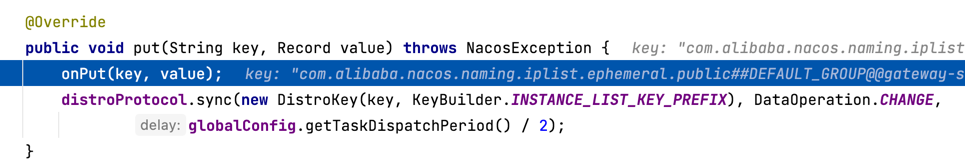
onPut()方法：

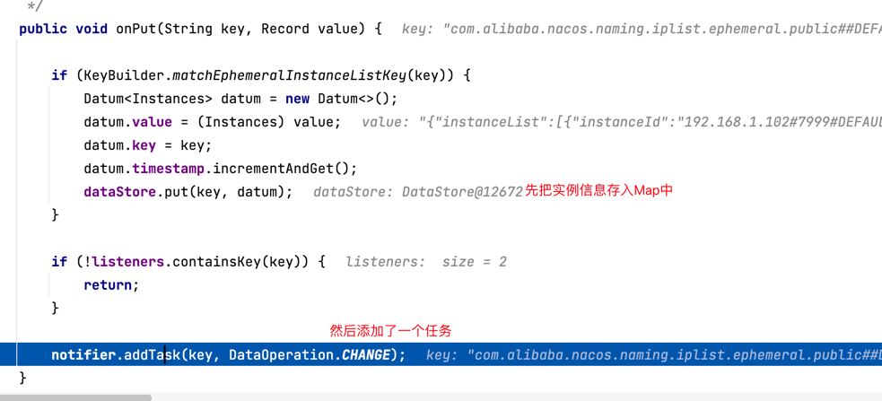


6. notifier 是一个 com.alibaba.nacos.naming.consistency.ephemeral.distro.DistroConsistencyServiceImpl 内部类。
   并且在DistroConsistencyServiceImpl初始化时就通过一个单线程开始一个定时任务，不断从阻塞队列中获取任务，执行服务列表的更新
   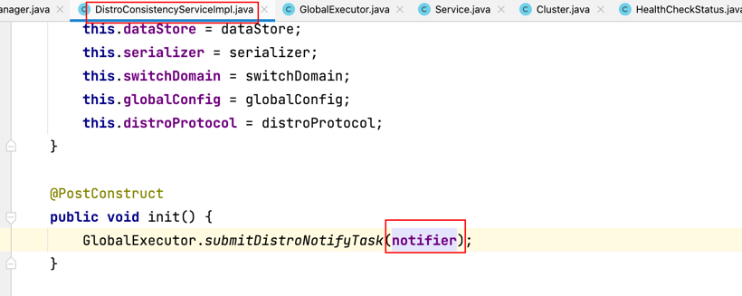

7. 在定时任务中处理代码：

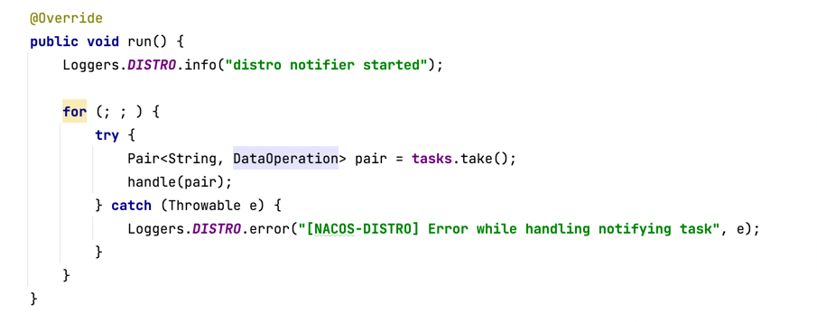

8. handle()方法如下，当服务变更了出发service类中的onChange方法。

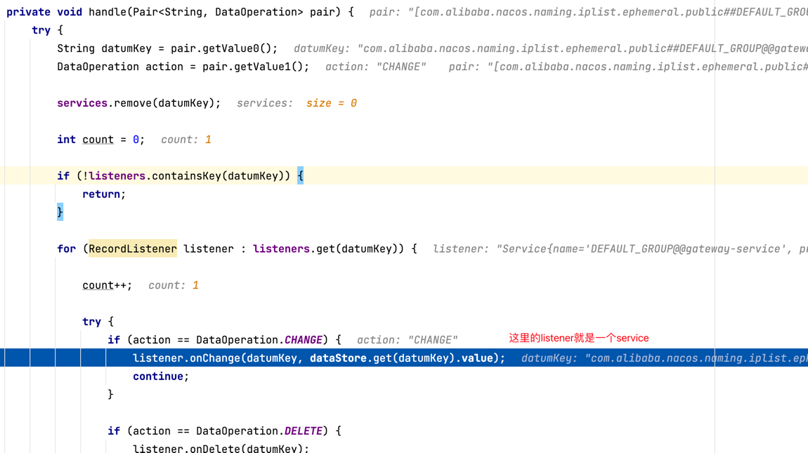

9. 在distroProtocol.sync 同步集群中节点的数据。

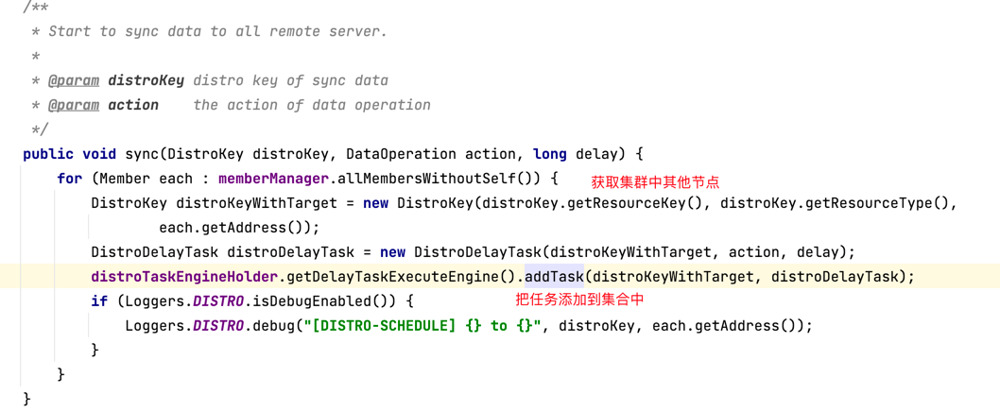

同步失败的话，会重试处理。属于AP模式。
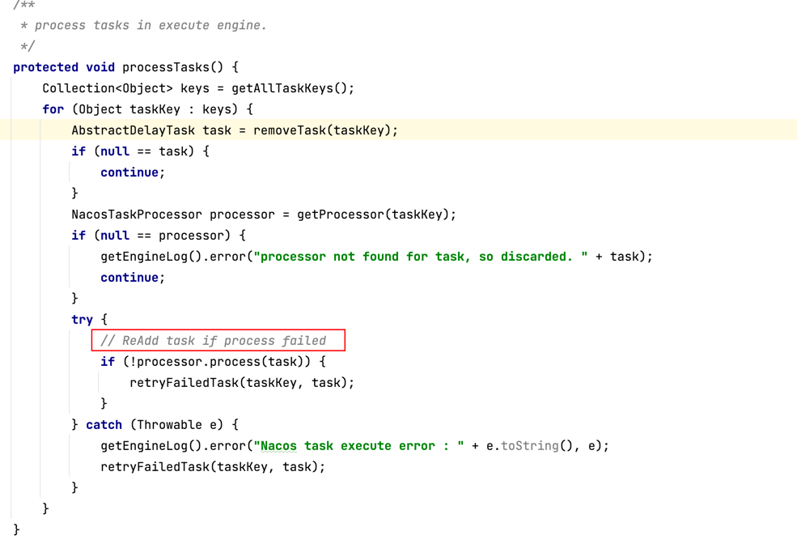

10. 通过Http的形式给集群中其他节点同步数据。

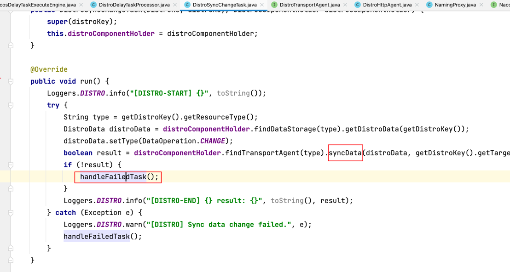

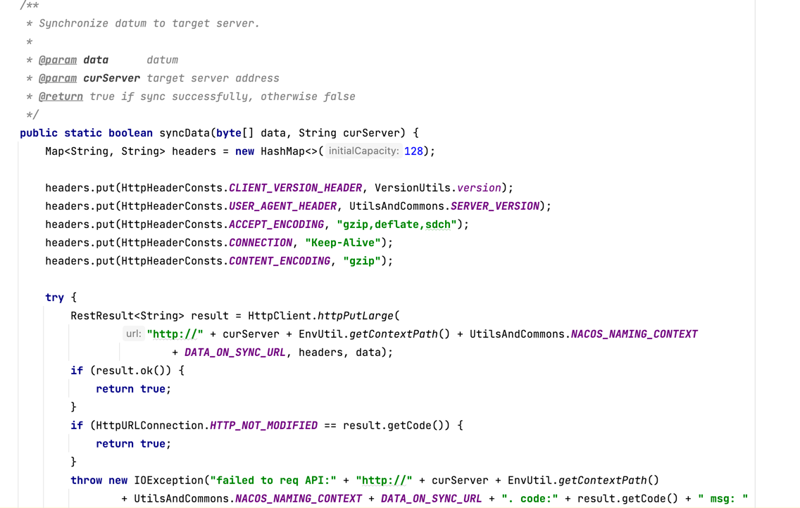


#### 持久化节点的数据同步
代码在com.alibaba.nacos.naming.consistency.persistent.raft.RaftCore#signalPublish
如果是该节点不是leader，转发给leader处理，如果是leader，则会向所有节点发起提交请求，提交请求就是要把该数据同步到本地文件中。
```java 
 public void signalPublish(String key, Record value) throws Exception {
        if (stopWork) {
            throw new IllegalStateException("old raft protocol already stop work");
        }
        if (!isLeader()) {
            ObjectNode params = JacksonUtils.createEmptyJsonNode();
            params.put("key", key);
            params.replace("value", JacksonUtils.transferToJsonNode(value));
            Map<String, String> parameters = new HashMap<>(1);
            parameters.put("key", key);
            
            final RaftPeer leader = getLeader();
            // 转发给leaer处理
            raftProxy.proxyPostLarge(leader.ip, API_PUB, params.toString(), parameters);
            return;
        }
        
        OPERATE_LOCK.lock();
        try {
            final long start = System.currentTimeMillis();
            final Datum datum = new Datum();
            datum.key = key;
            datum.value = value;
            if (getDatum(key) == null) {
                datum.timestamp.set(1L);
            } else {
                datum.timestamp.set(getDatum(key).timestamp.incrementAndGet());
            }
            
            ObjectNode json = JacksonUtils.createEmptyJsonNode();
            json.replace("datum", JacksonUtils.transferToJsonNode(datum));
            json.replace("source", JacksonUtils.transferToJsonNode(peers.local()));
            
            onPublish(datum, peers.local());
            
            final String content = json.toString();
            
            // 等待大多数节点提交成功，才认为是成功，问题：如果有一部分没有成功，那数据就不一致了，怎么处理？
            final CountDownLatch latch = new CountDownLatch(peers.majorityCount());
            for (final String server : peers.allServersIncludeMyself()) {
                if (isLeader(server)) {
                    latch.countDown();
                    continue;
                }
                final String url = buildUrl(server, API_ON_PUB);
                HttpClient.asyncHttpPostLarge(url, Arrays.asList("key", key), content, new Callback<String>() {
                    @Override
                    public void onReceive(RestResult<String> result) {
                        if (!result.ok()) {
                            Loggers.RAFT
                                    .warn("[RAFT] failed to publish data to peer, datumId={}, peer={}, http code={}",
                                            datum.key, server, result.getCode());
                            return;
                        }
                        latch.countDown();
                    }
                    
                    @Override
                    public void onError(Throwable throwable) {
                        Loggers.RAFT.error("[RAFT] failed to publish data to peer", throwable);
                    }
                    
                    @Override
                    public void onCancel() {
                    
                    }
                });
                
            }
            
            if (!latch.await(UtilsAndCommons.RAFT_PUBLISH_TIMEOUT, TimeUnit.MILLISECONDS)) {
                // only majority servers return success can we consider this update success
                Loggers.RAFT.error("data publish failed, caused failed to notify majority, key={}", key);
                throw new IllegalStateException("data publish failed, caused failed to notify majority, key=" + key);
            }
            
            long end = System.currentTimeMillis();
            Loggers.RAFT.info("signalPublish cost {} ms, key: {}", (end - start), key);
        } finally {
            OPERATE_LOCK.unlock();
        }
    }
```
有一个疑问：如果有一部分节点没有同步成功，那数据就不一致了，怎么处理？

```java 
/**
     * Do publish. If leader, commit publish to store. If not leader, stop publish because should signal to leader.
     *
     * @param datum  datum
     * @param source source raft peer
     * @throws Exception any exception during publish
     */
    public void onPublish(Datum datum, RaftPeer source) throws Exception {
        if (stopWork) {
            throw new IllegalStateException("old raft protocol already stop work");
        }
        RaftPeer local = peers.local();
        if (datum.value == null) {
            Loggers.RAFT.warn("received empty datum");
            throw new IllegalStateException("received empty datum");
        }
        
        if (!peers.isLeader(source.ip)) {
            Loggers.RAFT
                    .warn("peer {} tried to publish data but wasn't leader, leader: {}", JacksonUtils.toJson(source),
                            JacksonUtils.toJson(getLeader()));
            throw new IllegalStateException("peer(" + source.ip + ") tried to publish " + "data but wasn't leader");
        }
        
        if (source.term.get() < local.term.get()) {
            Loggers.RAFT.warn("out of date publish, pub-term: {}, cur-term: {}", JacksonUtils.toJson(source),
                    JacksonUtils.toJson(local));
            throw new IllegalStateException(
                    "out of date publish, pub-term:" + source.term.get() + ", cur-term: " + local.term.get());
        }
        
        local.resetLeaderDue();
        
        // if data should be persisted, usually this is true:
        if (KeyBuilder.matchPersistentKey(datum.key)) {
            raftStore.write(datum);   // 如果是持久化客户端，则写入磁盘
        }
        
        datums.put(datum.key, datum);
        
        if (isLeader()) {
            local.term.addAndGet(PUBLISH_TERM_INCREASE_COUNT);
        } else {
            if (local.term.get() + PUBLISH_TERM_INCREASE_COUNT > source.term.get()) {
                //set leader term:
                getLeader().term.set(source.term.get());
                local.term.set(getLeader().term.get());
            } else {
                local.term.addAndGet(PUBLISH_TERM_INCREASE_COUNT);
            }
        }
        raftStore.updateTerm(local.term.get());
        NotifyCenter.publishEvent(ValueChangeEvent.builder().key(datum.key).action(DataOperation.CHANGE).build());
        Loggers.RAFT.info("data added/updated, key={}, term={}", datum.key, local.term);
    }
```


### 总结
- 使用了很多的异步任务和队列，Nacos内部会将服务注册的任务放入阻塞队列，采用线程池异步来完成实例更新，从而提高并发写能力。
- 免并发读写的冲突 ，Nacos在更新实例列表时，会采用CopyOnWrite技术，首先将Old实例列表拷贝一份，然后更新拷贝的实例列表，再用更新后的实例列表来覆盖旧的实例列表。
- 临时节点采用Distro协议，持久化节点采用Raft协议处理。